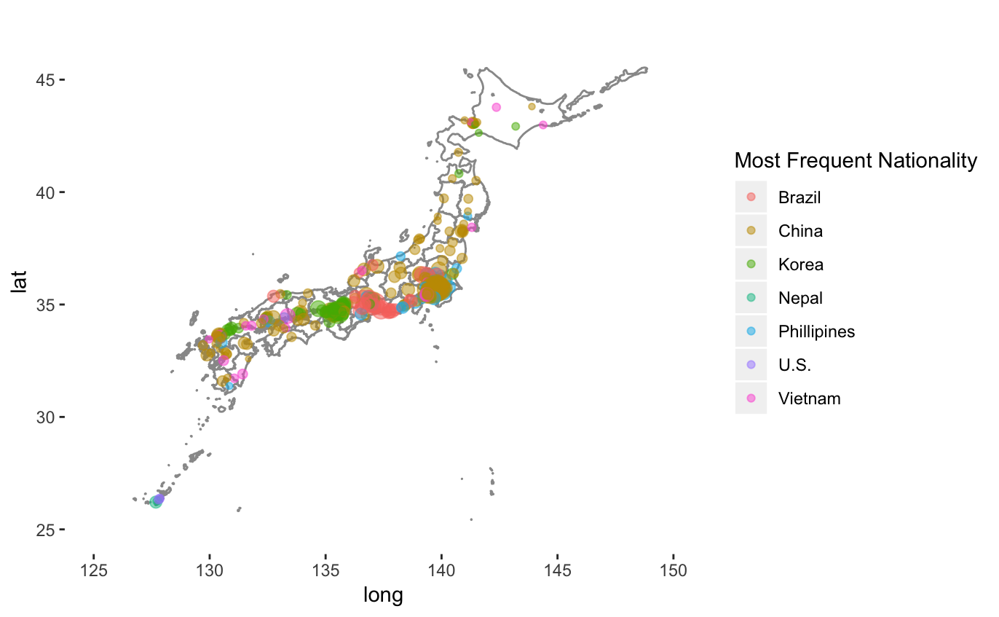
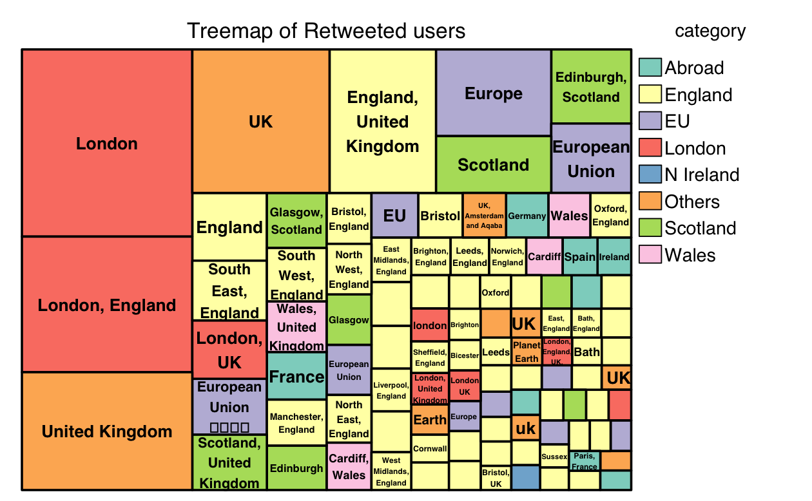
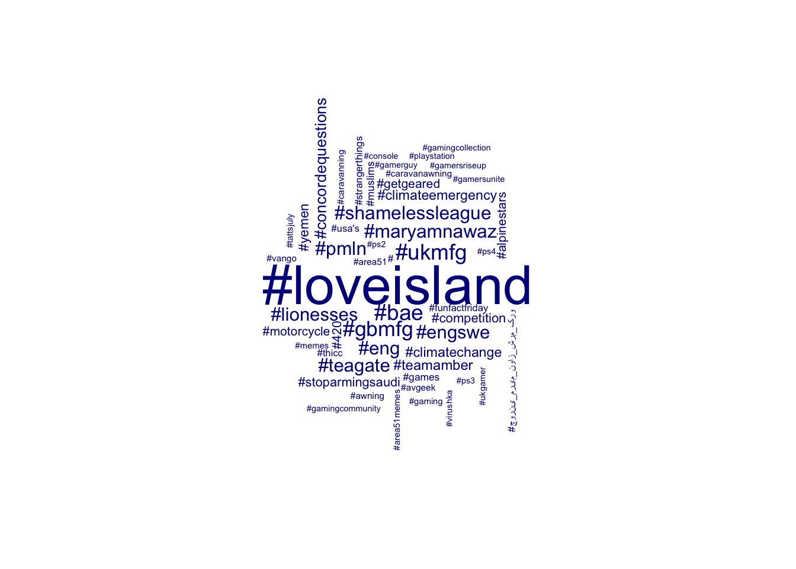

## Keisuke Idemitsu

### MSc in [*Management of Information Systems and Digital Innovation*](https://www.lse.ac.uk/study-at-lse/Graduate/degree-programmes-2021/MSc-Management-Information-Systems-and-Digital-Innovation "MISDI") at the London School of Economics (2019/20 Distinction)
### MSc in [*Applied Social Data Science*](http://www.lse.ac.uk/Methodology/Study/MSc-Applied-Social-Data-Science "ASDS") at the London School of Economics (2018/19 Distinction)

  - [k.idemitsu@lse.ac.uk](mailto:k.idemitsu@lse.ac.uk "email")
  - [Keisuke Idemitsu (github)](http://www.github.com/lightsystems/ "Github page")
  - [Keisuke Idemitsu (RIETI consulting fellow)](https://www.rieti.go.jp/users/idemitsu-keisuke/index_en.html "RIETI page")
  - [Download my CV](http://lightsystems.github.io/k_idemitsu/static/CV_IDEMITSU.pdf "CV download")

## [Research examples 1: Sentiment analysis on Japanese local area](http://lightsystems.github.io/k_idemitsu/research/LocalJapan.html "Research 1")

## [Research examples 2: #Revokearticle50 movement in March 2019](http://lightsystems.github.io/k_idemitsu/research/50revoke.html "Research 2")

## [Research examples 3: Teenager trends](http://lightsystems.github.io/k_idemitsu/research/teenagers.html "Research 3")

## [Blogs](http://lightsystems.github.io/k_idemitsu/blogs/agilehr-community.html "Blogs")

## [Talks](http://lightsystems.github.io/k_idemitsu/talks.html "Talks")
